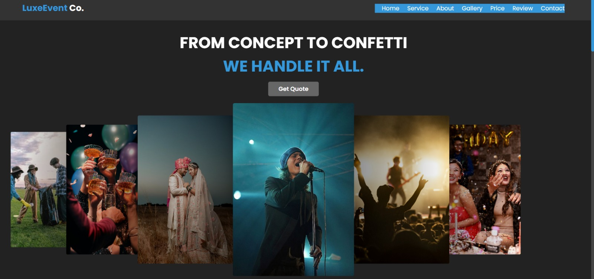
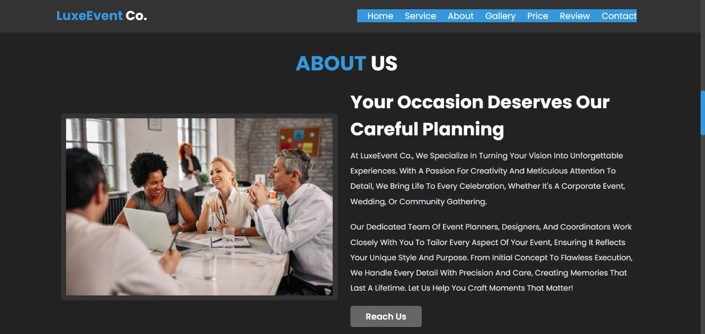
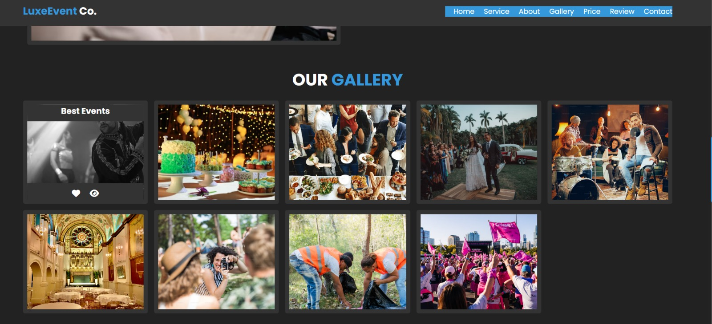
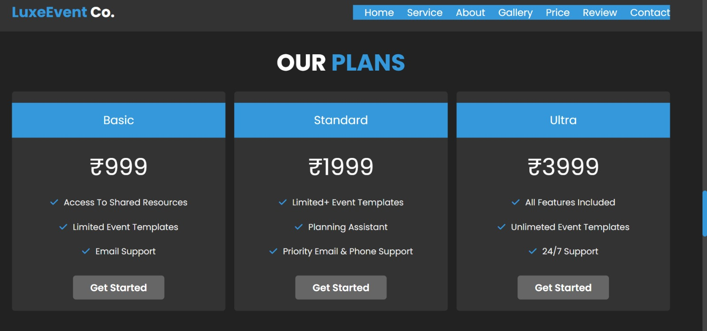
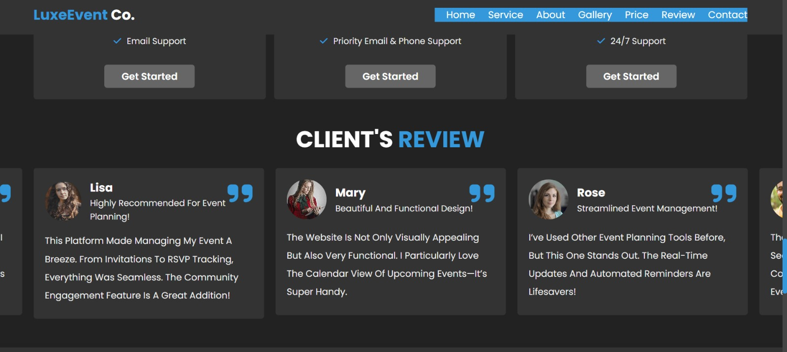
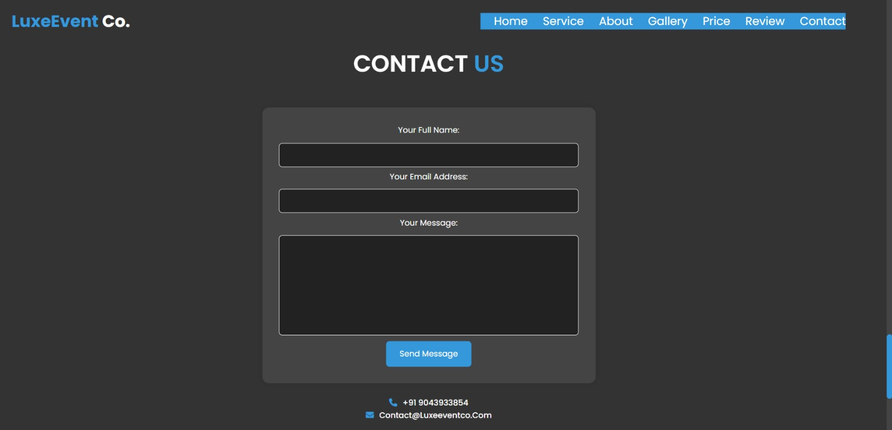
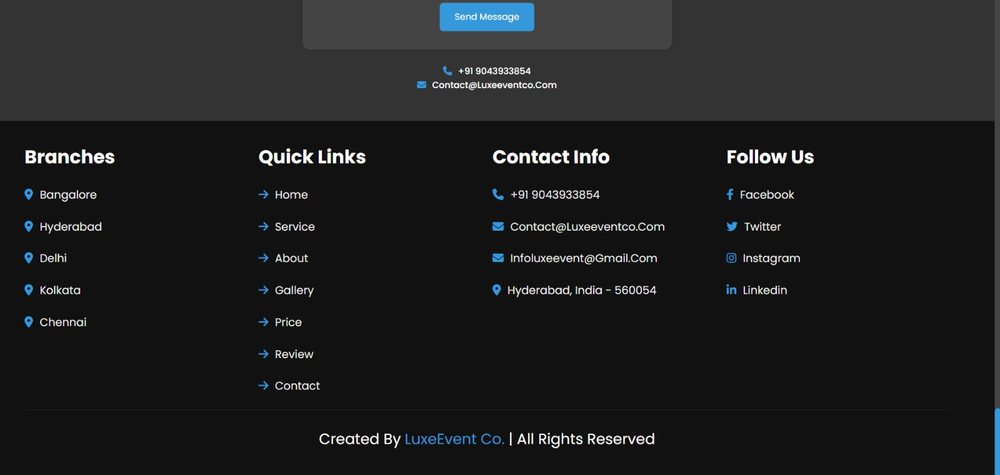

# LuxeEvent-Co

**LuxeEvent-Co** is a responsive and engaging **event management frontend website** built with HTML, CSS, and JavaScript. It showcases services, pricing, testimonials, and contact forms suitable for event planning businesses.

## Live Demo

View the live website here:  
[Luxeevent-Co.](https://luxeeventco.vercel.app)

##  Features

- Fully responsive layout — works on mobile, tablet & desktop  
- Navigation bar with smooth scrolling  
- Services section with icons and descriptions  
- Pricing plans with call-to-action buttons  
- Gallery showcasing event photos  
- Testimonials / Client Reviews  
- Contact section with form & contact details  
- Google map and social links (optional integration)

## Screenshots

